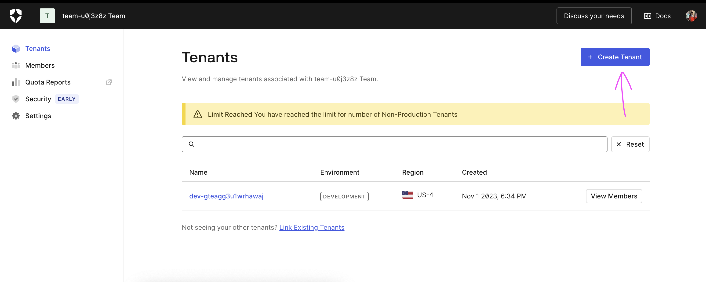
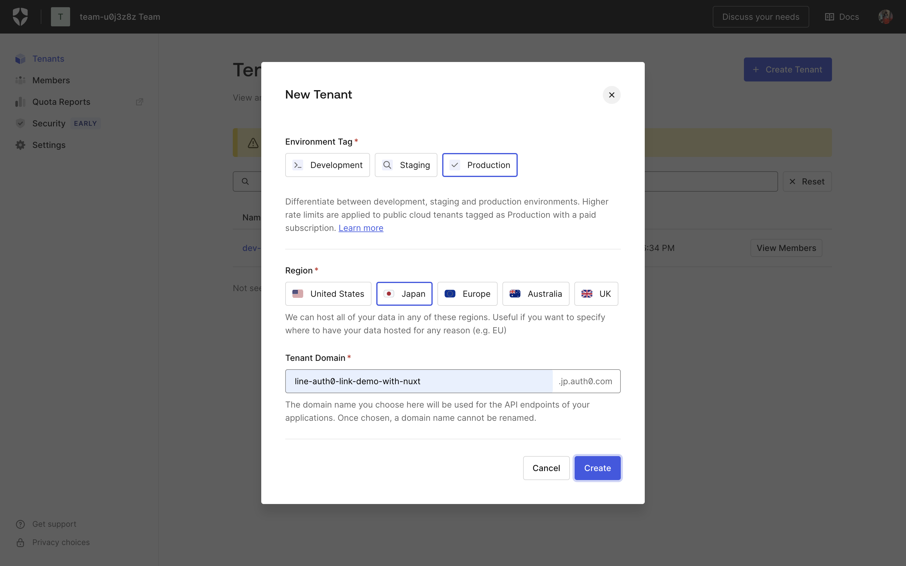
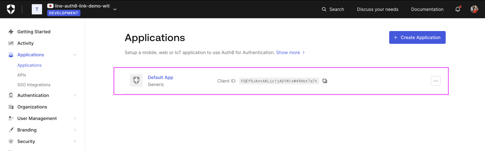
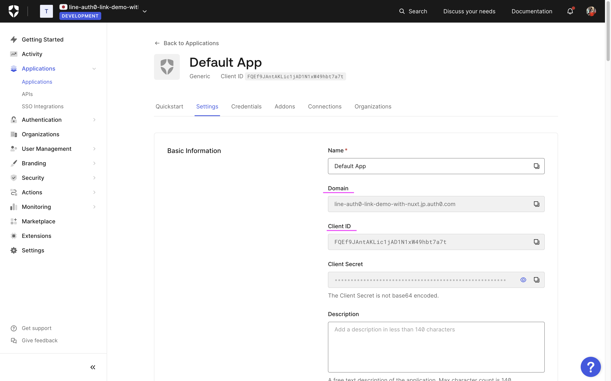
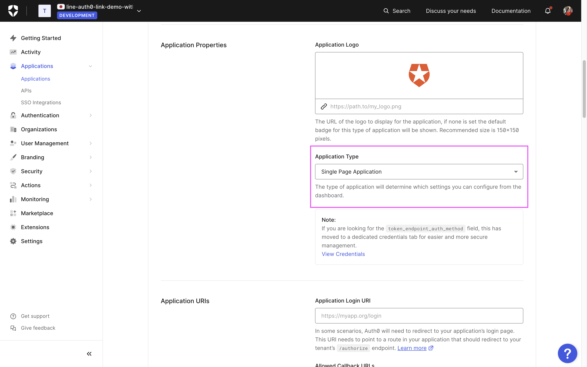
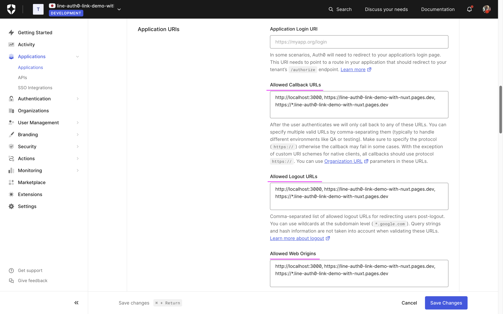
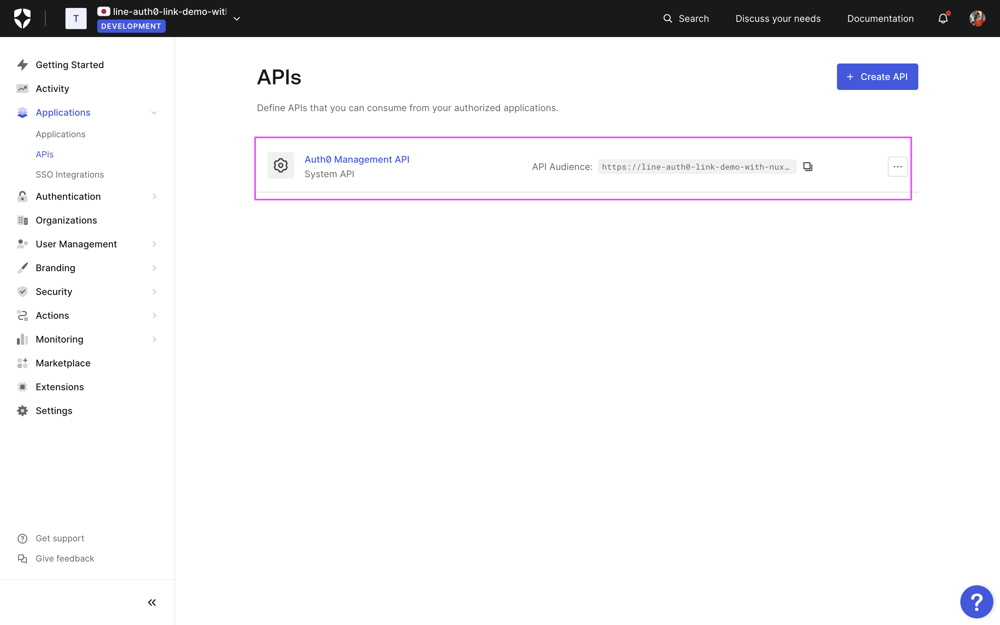

# Auth0 運用開始までの手順

## 1. テナント作成

---

1. [Auth0 のサインアップページ](https://auth0.com/signup)にアクセスします。

2. メールアドレスとパスワードを入力し、アカウントを作成します。

3. [テナント作成画面](https://accounts.auth0.com/teams) に遷移し、テナントを作成します。

   <div style="display: flex; flex-direction: column; align-items: center; max-width: 400px;">
     
     
    </div>

<br />

## 2. アプリケーション設定

---

1. 前章で作成したテナントにログインし、左のタブから `Applications > Applications` に遷移します。

2. `Default App` が既に作成されているので、クリックし編集画面に遷移します。
   

3. `Domain`, `Client ID` が表示されているので、こちらをコピーして環境変数に書き加えます。

    

   ```sh
   	# .env
   	WEB_AUTH0_DOMAIN=... # 追記
   	WEB_AUTH0_AUDIENCE=
   	WEB_AUTH0_CLIENT_ID=... # 追記
   ```

   ※ `WEB_AUTH0_AUDIENCE` は次の章で設定します。

4. そのページのまま `Application Properties` のセクションに下スクロールします。

5. `Application Type` を `Single Page Application` に変更します

   

6. さらに、そのページのまま `Application URLs` のセクションに下スクロールします。

7. `Allowed Callback URLs`, `Allowed Logout URLs`, `Allowed Web Origins` に、アプリケーションの URL を「開発用」と「本番用」の両方を必要に応じて追加します。

   

   ※ 複数の URL を設定する場合は、`,`（カンマ）で区切ります。
   ※ Redirect を用いた認証を行いたい場合は `Allowed Login URLs` にも追加する必要があります。

8. `Save Changes` をクリックして設定を保存します。

<br />

## 3. API 設定

ログイン機能を Client のみで実装する場合は不要ですが、API との連携を行う場合は設定が必要です。

この設定をしないと、Access Token が正しく発行されないため、API での JWT の検証がうまくいきません。

Auth0 を用いた JWT 認証に関しては情報が結構少ないので、注意しましょう。

---

1.  `Applications > APIs` に遷移します。

2.  `Auth0 Management API` が既に作成されているので、クリックし編集画面に遷移します。

    

3.  `Identifier` が表示されているので、こちらをコピーして環境変数に書き加えます。

    ```sh
    	# .env
    	WEB_AUTH0_DOMAIN=...
    	WEB_AUTH0_AUDIENCE=... # 追記
    	WEB_AUTH0_CLIENT_ID=...
    ```
